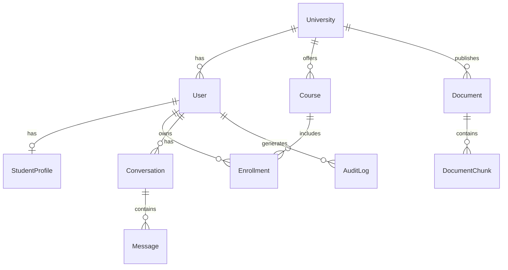

# CampusOS AI — Architecture

System design overview for the AI Operating System for Higher Education.

**Related:** [IMPLEMENTATION_PLAN.md](IMPLEMENTATION_PLAN.md) | [AGENTS.md](AGENTS.md) | [TASK_TRACKER.md](TASK_TRACKER.md)

---

## System Overview

CampusOS AI is an orchestrator-centric multi-agent platform. User messages enter through the API gateway, get classified by intent, routed to a specialized agent, and enriched with personalized memory, RAG retrieval, and knowledge graph context before returning a cited response.

```mermaid
flowchart TB
    subgraph clients [Client Layer]
        WebPortal[Next.js Web Portal]
        MobileApp[Mobile App - Future]
        Channels[Email SMS Teams Slack]
    end

    subgraph gateway [API Gateway]
        FastAPI[FastAPI Router]
        Auth[SSO and JWT Auth]
        RBAC[RBAC Middleware]
    end

    subgraph orchestration [Agent Orchestration]
        Orch[Orchestrator]
        Registry[Agent Registry]
    end

    subgraph agents [Specialized Agents]
        Knowledge[Knowledge]
        StudentSuccess[Student Success]
        AcademicAdvisor[Academic Advisor]
        Timetable[Timetable]
        CampusNav[Campus Navigation]
        Career[Career]
        Admissions[Admissions]
        AdminAssist[Admin Assistant]
        FacultyIntel[Faculty Intelligence]
        Retention[Retention]
        Research[Research Assistant]
    end

    subgraph platform [Core Platform Services]
        Memory[Student Memory]
        RAG[RAG Service]
        KG[Knowledge Graph]
        Workflows[Workflow Engine]
        LLM[LLM Service]
        Audit[Audit Log]
        Notify[Notification Service]
    end

    subgraph data [Data Layer]
        PG[(PostgreSQL + pgvector)]
        Redis[(Redis)]
        GraphDB[(Knowledge Graph DB)]
    end

    clients --> gateway
    gateway --> orchestration
    orchestration --> agents
    agents --> platform
    platform --> data
```



---

## Request Flow

1. User sends message via web portal (or future channel adapter)
2. FastAPI validates JWT and checks RBAC permissions
3. Orchestrator scores all registered agents via `can_handle(message, role)`
4. Highest-scoring agent executes with `AgentContext` (message, role, memory)
5. Agent may call RAG, knowledge graph, workflow engine, or DB services
6. Response returned with agent name, message, citations, and metadata
7. Audit log entry created for the interaction

---

## Repository Structure

| Directory | Responsibility |
|---|---|
| `backend/app/api/` | REST API routes |
| `backend/app/agents/` | 12 specialized agent modules + orchestrator |
| `backend/app/core/` | Config, security, RBAC, memory |
| `backend/app/models/` | SQLAlchemy ORM models |
| `backend/app/schemas/` | Pydantic request/response schemas |
| `backend/app/services/` | RAG, LLM, workflows, knowledge graph |
| `backend/app/db/` | Database session and migrations |
| `frontend/src/app/` | Next.js pages (landing, chat, dashboard) |
| `frontend/src/components/` | Reusable UI components |
| `frontend/src/lib/` | API client |
| `docs/` | Architecture, plan, task tracker |
| `scripts/` | Seed and utility scripts |

---

## Data Model



### Core Tables

| Table | Purpose |
|---|---|
| `universities` | Multi-tenant root entity |
| `users` | SSO-linked accounts with role |
| `student_profiles` | Credits, program, standing, interests |
| `courses` | Course catalog |
| `enrollments` | Student-course relationships |
| `documents` | Policy/handbook source documents |
| `document_chunks` | Chunked content with vector embeddings |
| `conversations` | Chat session containers |
| `messages` | Individual chat messages with agent metadata |
| `audit_logs` | FERPA/GDPR compliance trail |

---

## Security Model

### Authentication

- Phase 0: No auth (development stub)
- Phase 1: OIDC/SAML SSO with JWT sessions

### Role-Based Access Control

| Role | Permissions |
|---|---|
| `student` | Chat, own profile, own courses, public documents |
| `faculty` | Chat, student roster, course analytics, public documents |
| `admin` | All students, document management, workflows, audit logs |
| `admissions` | Prospect data, application management |
| `career_services` | Student profiles, opportunity management |
| `executive` | Dashboards, predictive analytics, audit logs |

Defined in `backend/app/core/rbac.py`. Agents must check permissions before returning sensitive data.

### Compliance

- **FERPA:** Students can only access their own educational records
- **GDPR:** Audit logs track all personal data access; right to deletion supported in Phase 1
- **Encryption:** TLS in transit; database encryption at rest via managed Postgres

---

## Agent Orchestration

The orchestrator (`backend/app/agents/orchestrator.py`) uses keyword-based intent scoring in Phase 0. Future phases will add LLM-based routing.

Each agent implements:

```python
class Agent(ABC):
    name: str
    description: str
    keywords: list[str]

    def can_handle(self, message: str, user_role: str) -> float: ...
    async def run(self, context: AgentContext) -> AgentResult: ...
```

Agents are registered at startup via `AgentRegistry.register_all()`.

---

## Deployment

### Local Development

```bash
docker compose up --build
```

Services: backend (8000), frontend (3000), postgres (5432), redis (6379).

### Production (Render)

Defined in `render.yaml`:

- `campusos-api` — FastAPI web service (binds `0.0.0.0:$PORT`)
- `campusos-web` — Next.js web service
- `campusos-db` — Managed PostgreSQL

Render constraints:
- Ephemeral filesystem — no local file persistence
- Free tier spin-down after 15 minutes inactivity
- Linux case-sensitive paths

---

## Technology Stack

| Layer | Technology |
|---|---|
| API | FastAPI (Python 3.11+) |
| Frontend | Next.js 15 (React 19) |
| Database | PostgreSQL 16 + pgvector |
| Cache/Queue | Redis 7 |
| LLM | OpenAI (Phase 2+) |
| Knowledge Graph | Neo4j or PG graph (Phase 7) |
| Deployment | Docker + Render |

---

## Future Architecture Additions

| Component | Phase | Description |
|---|---|---|
| Background workers | 4 | Celery/Render workers for async workflows |
| Notification hub | 6 | Multi-channel proactive messaging |
| Knowledge graph | 7 | Entity-relationship digital twin |
| Voice/multilingual | 8 | STT/TTS and i18n layer |
| CI/CD | 8 | GitHub Actions pipeline |

See [IMPLEMENTATION_PLAN.md](IMPLEMENTATION_PLAN.md) for detailed phase breakdown.
